# 📂ATRANS

파일 변환 Tool 프로그램 by @ash0814 안세현

## ⚙ 프로그램 소개

텍스트(.atxt) <-> 바이너리(.abin) 파일 변환 프로그램

## 📋 프로그램 메뉴얼

### 1. 프로그램 실행

- ATRANS.exe 실행

<kbd> 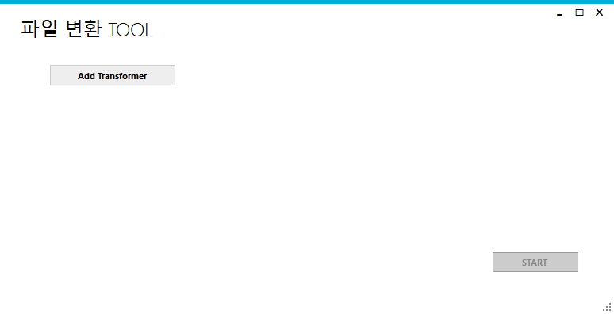 </kbd>

### 2. 변환기 설정

- `Add Transformer` 버튼 클릭
  <kbd> 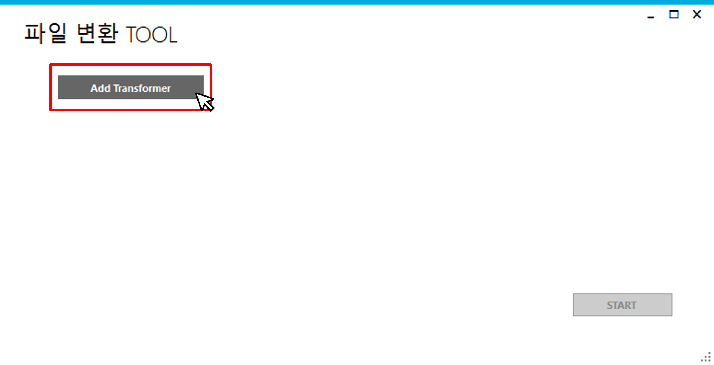 </kbd>
- 변환기 설정 창
  <kbd>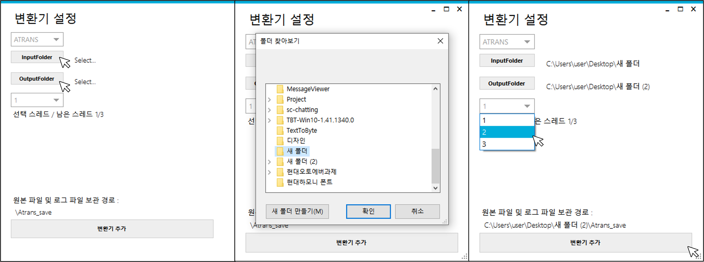</kbd>

  - 변환기 설정 창에서 변환 타입 (ATRANS) 을 선택한 후, 입력 경로와 출력 경로, 사용 스레드 개수를 추가한다.
  - 입력 경로와 출력 경로는 같을 수 없으며, 모든 경로를 선택해야 변환기를 추가할 수 있다.
  - 모든 변환기의 스레드의 합은 3을 넘을 수 없으며, 변환 타입 한 개당 한 개의 변환기를 설정할 수 있다. (현재는 ATRANS만 있으므로, ATRANS타입의 변환기 한 개만 사용할 수 있다.)
  - 로그파일과 원본 파일을 저장할 보관경로는 `출력경로\Atrans_save` 폴더로 지정된다.

- 변환기 설정 완료
  <kbd>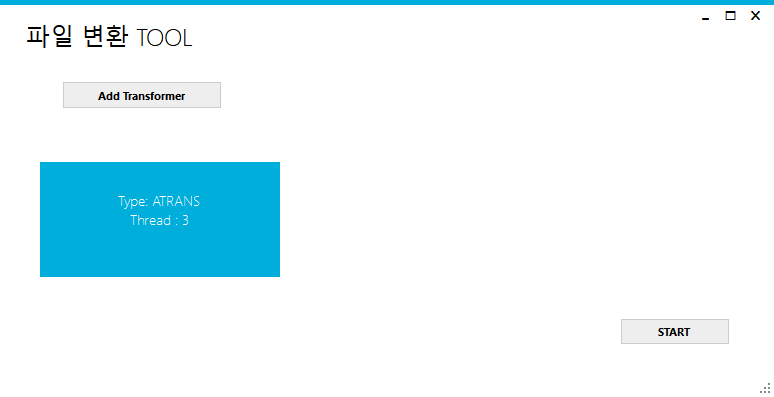 </kbd>
  - 변환기를 추가하면 타일이 추가된다,
  - 타일에는 변환기의 변환 타입과 사용 스레드의 개수가 나타난다.
  - 해당 타일을 클릭하면, 변환기 설정 창이 다시 나타나 설정을 변경할 수 있다.
  - 변환기가 1개 이상 생성되면, `START` 버튼이 활성화된다.

### 3. 변환 스레드 시작

- 'START' 클릭
  <kbd>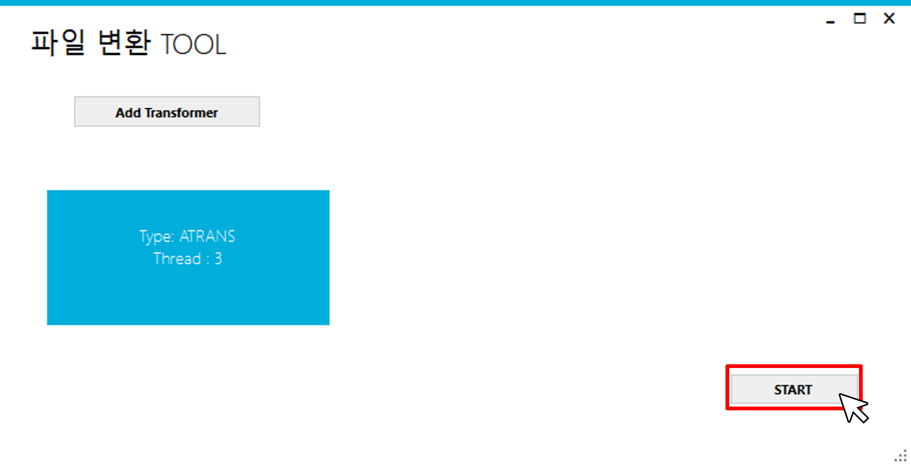 </kbd>

- 스레드 작업 시작
  <kbd>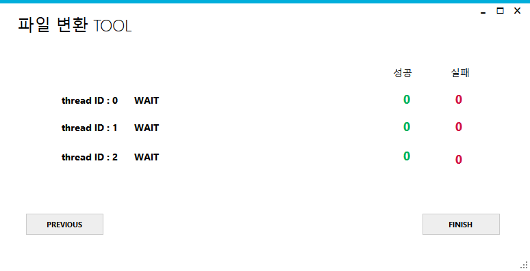 </kbd>
  - 변환기에 설정한 스레드가 작업을 시작한다.
    <kbd>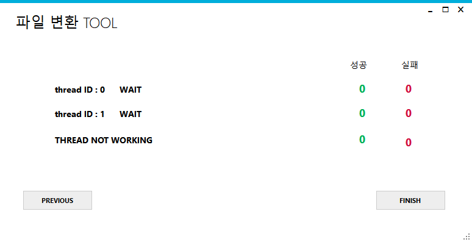 </kbd>
    - 스레드를 3개 미만으로 설정했을 때에는 사용하지 않는 스레드는 `THREAD NOT WORKING`으로 표시된다.

### 4. 파일 입력

- 설정한 입력 경로에 파일을 추가한다.
  <kbd>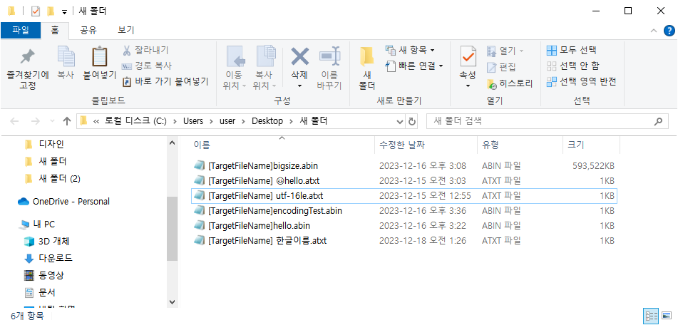 </kbd>

  - 입력 파일의 이름은 `[TargetFileName]` 으로 시작해야 한다.
    - `[TargetFileName]` 과 파일 이름 사이의 공백은 무시된다. 파일 이름과 확장자 사이의 공백도 무시된다.
  - 입력 파일 이름의 최대 길이는 확장자와 공백 포함, 192자이다.
  - 확장자가 대소문자 구문 없이 `.abin` 혹은 `.atxt` 가 아닌 경우는 인식하지 않고 아무런 동작을 하지 않는다.
  - 파일 이름에는 `\`, `/`, `:`, `*`, `?`, `"`, `<`, `>`, `|` 가 있을 수 없다.
  - 기존에 존재하던 파일 중 `.abin`나 `.atxt` 확장자의 파일이 있다면, 작업이 실행될 때 대기 큐에 함께 등록되어 작업을 진행한다.
    </br>
    </br>
  - 파일 내용의 첫번째 줄에는 헤더가 있어야 한다.
    - 헤더는 `[ATRANS] filename` 형식이다.
    - `.abin` 파일의 경우, 인코딩한 텍스트의 첫번째 줄이 헤더이다.
      </br>

- 파일 변환 실행
  <kbd>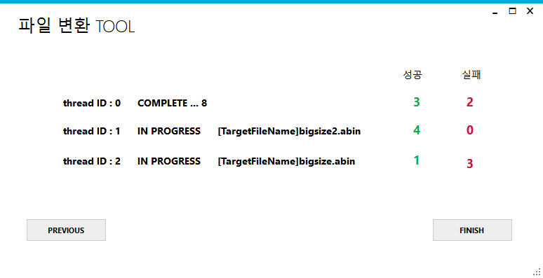 </kbd>

  - 입력된 파일을 변환하는 작업에 들어가면, 해당 스레드는 `IN PROGRESS` 상태가 되며 진행중인 파일의 이름을 나타낸다.
  - 작업을 완료한 스레드는 `COMPLETE` 상태로 10초를 대기하며, 남은 대기 시간은 숫자로 표시된다.
  - 변환 작업에 성공하면 초록색 성공 카운트가, 실패하면 빨간색 실패 카운트가 증가한다.
  - 작업이 완료된 파일들은 파일 단위로 로그 파일을 생성하여 보관 경로에 저장한다.
  - 생성/이동 파일의 경로에 같은 이름의 파일이 존재한다면 파일의 뒤에 숫자를 붙여 저장한다.
    - 해당 파일의 헤더 역시 숫자가 붙은 파일 이름으로 저장된다.

- 오류 리스트 확인
  <kbd>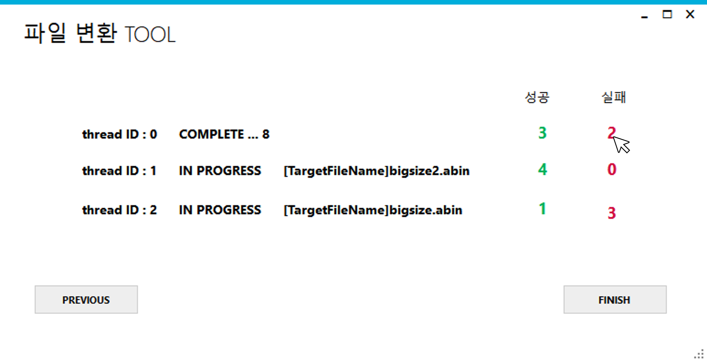 </kbd>

  - 실패(오류) 카운트 숫자를 클릭하여 에러 리스트를 새로운 창에서 확인할 수 있다.

  <kbd>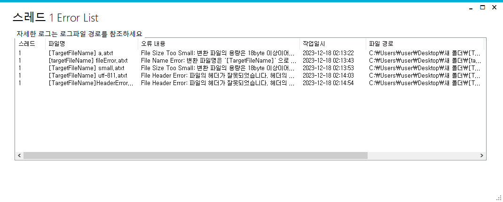 </kbd>

  - 에러 리스트는 해당 스레드의 오류 목록을 출력한다.
  - 스레드 번호, 파일명, 오류내용, 작업일시, 파일 경로와 로그 파일의 경로를 나타낸다.
  - 창을 열어둔 상태에서 오류가 발생할 시 자동으로 오류 내역이 추가된다.

### 5. 프로그램 중지

<kbd>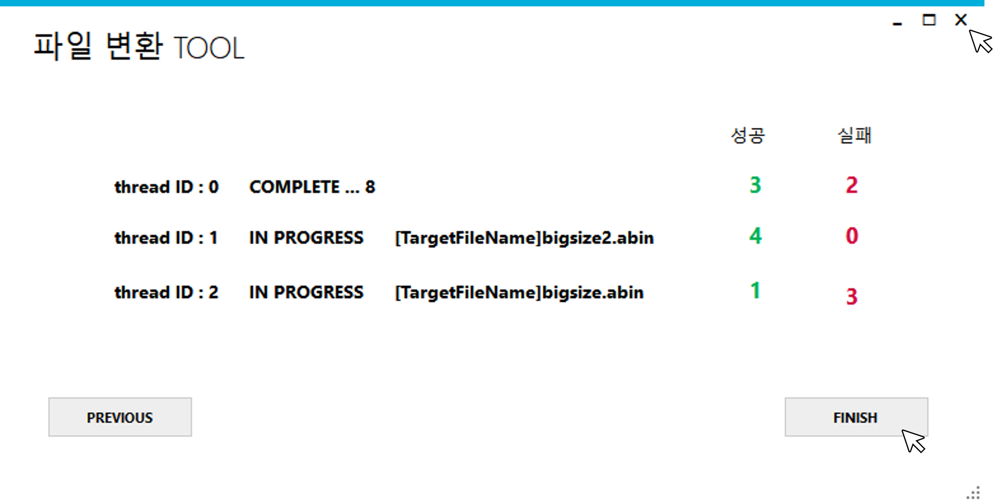 </kbd>

- `FINISH` 버튼 혹은 상단 `x` 버튼을 통해 프로그램을 종료시킬 수 있다.
  <kbd>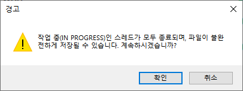 </kbd>
  - 경고창이 뜨고, `확인` 을 클릭하면 프로그램이 종료된다.
  - 대기중이던 ATRANS 입력 파일은 모두 보관경로로 이동하며, 로그파일이 생성된다.
  - 파일이 열린 상태로 작업 중에 스레드를 종료할 경우, 파일이 완성되지 않은 상태에서 종료될 수 있다.

<kbd>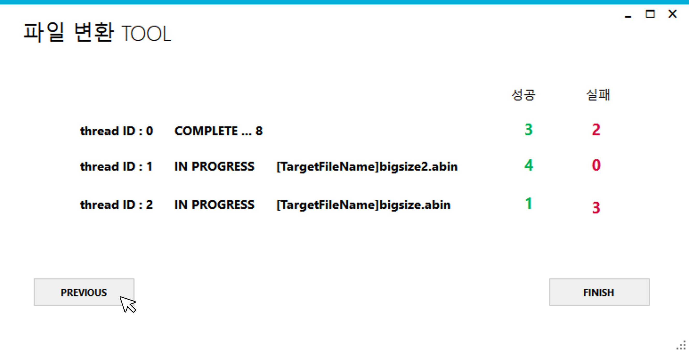 </kbd>

- `PREVIOUS` 버튼을 클릭하여 이전 화면 (변환기 설정 화면) 으로 이동할 수 있다.
  - 종료버튼과 마찬가지로 경고창이 뜬다.
  - 이전화면으로 넘어갈 시, 기존에 존재하던 스레드는 모두 종료되고 대기중이던 파일들이 모두 정리된다.
  - 이전 화면에서 스레드의 설정을 수정하여 다시 시작할 수 있다.

### 6. 로그 파일

- 각 파일들은 작업 이후 로그파일이 생성된다.
- 로그파일의 이름은 `'입력파일명'.'확장자'.'log'` 이다. (`[TargetFileName]` 제외)

- 로그파일 형식은 아래와 같다.

```text
ThreadNumber:            0
Transform Result:         SUCCESS
Transform Time :          11sec (2023-12-18 04:33:29 - 2023-12-18 04:33:40)

StartFileName:              [TargetFileName]bigsize.abin
StartFilePath:                C:\Users\user\Desktop\새 폴더
StartFileSize:                 593521KB(607766000byte)
StartFileCreateTime:     2023-12-17 15:32:19
StartFileEncoding:        System.Text.UTF8Encoding

EndFileName:               bigsize(1).atxt
EndFilePath:                 C:\Users\user\Desktop\새 폴더 (2)
EndFileSize:                  74190KB(75970753byte)
EndFileCreateTime:      2023-12-18 04:33:29

Log Message:              SUCCESS


Detail Error Messages=============

```

-오류가 발생하면 오류 메세지가 추가되며, 오류로 인해 EndFile이 존재하지 않을 경우 존재하지 않는 항목은 비워져있다.

```text
ThreadNumber:            0
Transform Result:         FAIL
Transform Time :          0sec (2023-12-18 02:28:04 - 2023-12-18 02:28:04)

StartFileName:              [TargetFileName]HeaderError.atxt
StartFilePath:                C:\Users\user\Desktop\새 폴더
StartFileSize:                 0KB(65byte)
StartFileCreateTime:     2023-12-17 22:23:48
StartFileEncoding:        System.Text.UTF8Encoding

EndFileName:
EndFilePath:
EndFileSize:                  0KB(0byte)
EndFileCreateTime:

Log Message:              File Header Error: 파일의 헤더가 잘못되었습니다.
 헤더의 형식은 '[ATRANS](space)(TrimmedFileName)(\n)' 입니다.


Detail Error Messages=============
File Header Error: 파일의 헤더가 잘못되었습니다.
 헤더의 형식은 '[ATRANS](space)(TrimmedFileName)(\n)' 입니다.
   위치: ATRANS.Transformer.ValidateFile(String filePath, FileData& logData) 파일 C:\Users\user\Desktop\autoever\ATRANS_2\ATRANS_2\TransformerUtils.cs:줄 26
   위치: ATRANS.Transformer.startTransfort(BlockingCollection`1 fileQueue, Int32 threadIdx, CancellationToken cancellationToken) 파일 C:\Users\user\Desktop\autoever\ATRANS_2\ATRANS_2\Transformer.cs:줄 257

System.Collections.ListDictionaryInternal
ATRANS_2Void ValidateFile(System.String, FileData ByRef)
```

---
